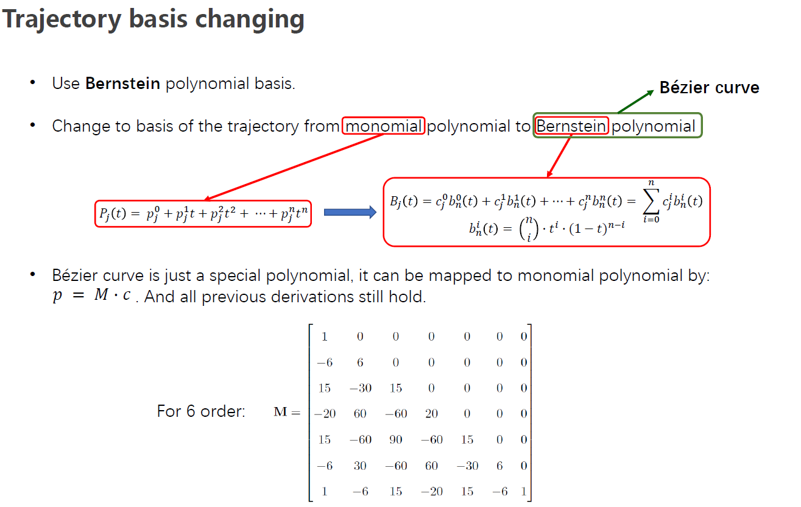
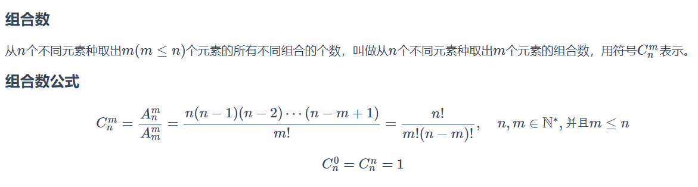
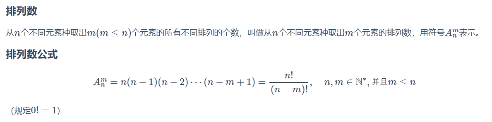
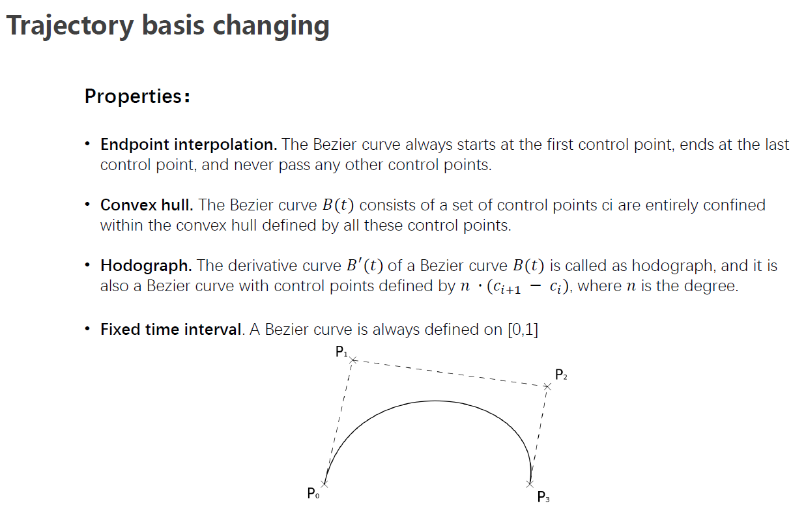
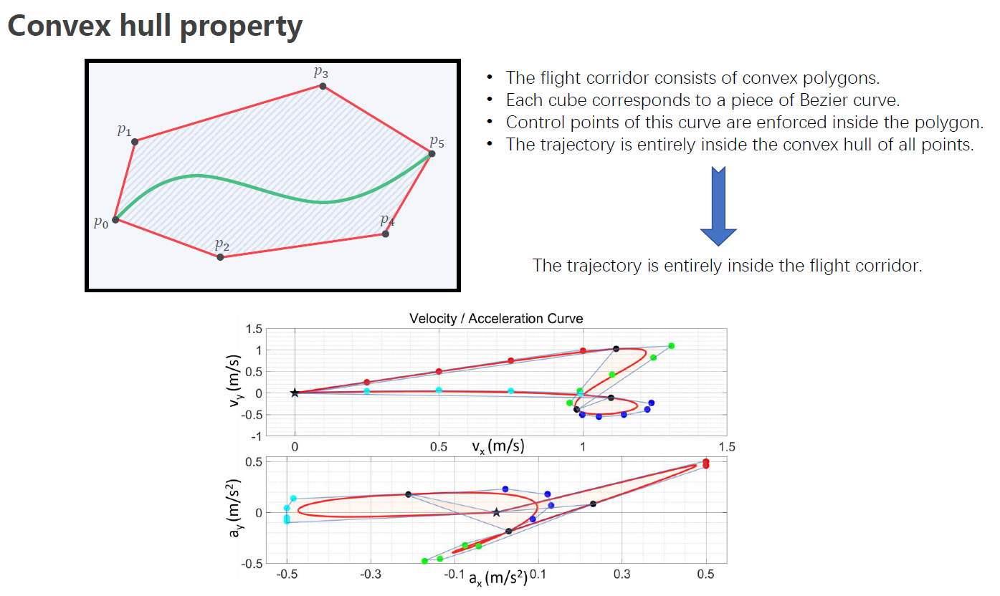
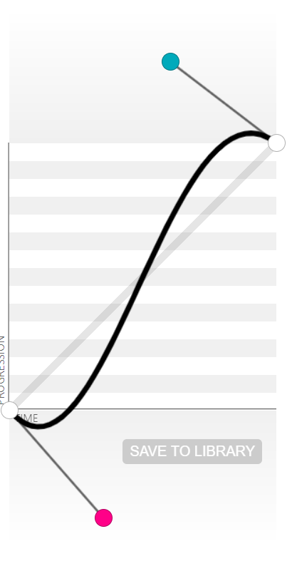

## 贝塞尔曲线

贝塞尔曲线，这个命名规则一眼看上去大概是一个叫贝塞尔的数学家发明的。但，贝塞尔曲线依据的最原始的数学公式，是在1912年在数学界广为人知的伯恩斯坦多项式。简单理解，伯恩斯坦多项式可以用来证明，在[ a, b ] 区间上所有的连续函数都可以用多项式来逼近，并且收敛性很强，也就是一致收敛。再简单点，就是一个连续函数，你可以将它写成若干个伯恩斯坦多项式相加的形式，并且，随着 n→∞，这个多项式将一致收敛到原函数，这个就是伯恩斯坦斯的逼近性质。[贝塞尔曲线简单介绍](https://blog.csdn.net/xiaozhangcsdn/article/details/98963937)或[必须要理解掌握的贝塞尔曲线](https://www.jianshu.com/p/0c9b4b681724)

时光荏苒岁月如梭，镜头切换到了1959年。当时就职于雪铁龙的法国数学家 Paul de Casteljau 开始对伯恩斯坦多项式进行了图形化的尝试，并且提供了一种数值稳定的德卡斯特里奥（de Casteljau） 算法。（多数理论公式是建立在大量且系统的数学建模基础之上研究的规律性成果）根据这个算法，就可以实现 通过很少的控制点，去生成复杂的平滑曲线，也就是贝塞尔曲线。

但贝塞尔曲线的声名大噪，不得不提到1962年就职于雷诺的法国工程师皮埃尔·贝塞尔（Pierre Bézier），他使用这种只需要很少的控制点就能够生成复杂平滑曲线的方法，来辅助汽车车体的工业设计，并且广泛宣传（典型的理论联系实际并获得成功的示例），因此大家称为贝塞尔曲线 。

既然贝赛尔曲线的本质是通过数学计算公式去绘制平滑的曲线，那就可以通过数学工具进行实际求证以及解释说明。

(上图中的pj是多项式系数，上方的0,1,2,3,..,n不是次方的意思，而是表示第几个系数；同样的cj，是贝塞尔曲线控制点，控制点坐标可以包含几个分量，如xyz分量，其上方的0,1,2,..,n表示第几个控制点，而不是次方的意思)
(n是阶次的意思，j=n+1，或者说系数总是比阶数大1，因为考虑0阶)

当贝塞尔曲线的控制点为三维坐标时，即可得到空间贝塞尔曲线。

这里的Pi就等于上上图中的控制点cj

[n 阶贝塞尔曲线计算公式实现](https://www.jianshu.com/p/7c56103dcf63)(公式讲解)

[排列组合的一些公式及推导(非常详细易懂)](https://www.cnblogs.com/1024th/p/10623541.html)

[常用组合数计算公式](https://blog.csdn.net/shadandeajian/article/details/82084087)

(根据凸包性质，可以对pvaj进行约束)

(一次贝塞尔曲线：1个线段，2个控制点)

(二次贝塞尔曲线：2个线段，3个控制点)

(三次贝塞尔曲线：3个线段，4个控制点)

(四次贝塞尔曲线：4个线段，5个控制点)

(五次贝塞尔曲线：5个线段，6个控制点)

- 性质

1.端点性质：

   曲线的起点和终点就是特征多边形的第一个顶点和最后一个顶点。

   曲线的起点和终点处分别和特征多边形的第一条边和最后一条边相切。

   

2.对称性：

   保持控制点的位置不变，把他们顺序依次颠倒，得到的新的曲线和原来的曲线重合，只不过方向相反。

3.凸包性：

   曲线一定在特征多边形的凸包内。

4.保凸性：

   特征多边形是凸的，则曲线也是凸的。

5.几何不变性

6.最大影响点：

   （n+1）个控制点构造n次贝塞尔曲线，改变第i个控制点将对参数t=i/n处产生最大的影响。

     特征多边形在某种程度上象征着曲线的形状，但随着次数的升高，这种关系将减弱。

- 用处

[贝塞尔曲线扫盲](https://myst729.github.io/posts/2013/bezier-curve-literacy/)

正是因为控制简便却具有极强的描述能力，贝塞尔曲线在工业设计领域迅速得到了广泛的应用。不仅如此，在计算机图形学领域，尤其是矢量图形学，贝塞尔曲线也占有重要的地位。今天我们最常见的一些矢量绘图软件，如 Flash、Illustrator、CorelDraw 等，无一例外都提供了绘制贝塞尔曲线的功能。甚至像 Photoshop 这样的位图编辑软件，也把贝塞尔曲线作为仅有的矢量绘制工具（钢笔工具）包含其中。

贝塞尔曲线在 web 开发领域同样占有一席之地。CSS3 新增了 transition-timing-function 属性，它的取值就可以设置为一个三次贝塞尔曲线方程。在此之前，也有不少 JavaScript 动画库使用贝塞尔曲线来实现美观逼真的缓动效果。

能画曲线也能画直线，是不是很厉害？要绘制更复杂的曲线，控制点的增加也仅仅是线性的。这一特点使其不光在工业设计领域大展拳脚，就连数学基础不好的人也可以比较容易地掌握，比如大多数平面美术设计师们。

上面介绍的内容并不足以展示贝塞尔曲线的真正威力。推广到三维空间的贝塞尔曲面，以及更进一步的非均匀有理 B 样条（NURBS），早已成为当今计算机辅助设计（CAD）的行业标准，不论是我们平常用到的各种产品，还是在电影院看到的精彩大片，都少不了它们的功劳。

[贝塞尔曲线用途和种类](https://zh.javascript.info/bezier-curve)

对于贝塞尔曲线，最重要的点是数据点和控制点。
数据点： 指一条路径的起始点和终止点。
控制点：控制点决定了一条路径的弯曲轨迹
根据控制点的个数，贝塞尔曲线被分为一阶贝塞尔曲线（0个控制点）、二阶贝塞尔曲线（1个控制点）、三阶贝塞尔曲线（2个控制点）等等。

特点一：曲线通过始点和终点，并与特征多边形首末两边相切于始点和终点，中间点将曲线拉向自己。
特点二：平面离散点控制曲线的形状，改变一个离散点的坐标，曲线的形状将随之改变（点对曲线具有整体控制性）。
特点三：曲线落在特征多边形的凸包之内，它比特征多边形更趋于光滑。

贝塞尔曲线有着很多特殊的性质, 在图形设计和路径规划中应用都非常广泛, 我就是想在路径规划中

贝塞尔曲线完全由其控制点决定其形状,　ｎ个控制点对应着ｎ－１阶的贝塞尔曲线，并且可以通过递归的方式来绘制. 画重点了啊: 递归
[曲线篇: 贝塞尔曲线](https://zhuanlan.zhihu.com/p/136647181)

## B样条曲线

　Bezier曲线有许多优越性，但有两点不足：

　　（1） 特征多边形的顶点个数决定了Bezier曲线的阶次，并且在阶次较大时，特征多边形对曲线的控制将会减弱；

　　（2） Bezier曲线不能作局部修改，改变一个控制点的位置对整条曲线都有影响，其原因是基函数Bernstein的参数u在[0，1]区间内均不为零。

　　1972年，Gordon, Rie-feld等人拓展了Bezier曲线，用B样条基函数代替Bernstein基函数，即形成了B样条曲线、曲面。

B样条曲线曲面具有几何不变性、凸包性、保凸性、变差减小性、局部支撑性等许多优良性质，是目前CAD系统常用的几何表示方法，因而基于测量数据的参数化和B样条曲面重建是反求工程的研究热点和关键技术之一。

## 参考资料

* [排列组合的一些公式及推导(非常详细易懂)](https://www.cnblogs.com/1024th/p/10623541.html)
* [常用组合数计算公式](https://blog.csdn.net/shadandeajian/article/details/82084087)
* [n 阶贝塞尔曲线计算公式实现](https://www.jianshu.com/p/7c56103dcf63)
* [贝塞尔曲线-动画](https://www.jasondavies.com/animated-bezier/)
* [MTU图形学公开课：Introduction to Computing with Geometry](https://pages.mtu.edu/~shene/COURSES/cs3621/NOTES/)(含贝塞尔、B样条等：推荐)
* [上述公开课的中文博客](http://www.whudj.cn/?cat=23)
* [上述公开课的B样条翻译博客](https://blog.csdn.net/tuqu/category_612514.html)
* [A Primer on Bézier Curves](https://pomax.github.io/bezierinfo/zh-CN/)(英文优秀的贝塞尔教程：推荐)
* [曲线篇: 贝塞尔曲线](https://zhuanlan.zhihu.com/p/136647181)(中文优秀的贝塞尔教程)
* [曲线数学之贝塞尔曲线Bézier Curves](https://www.qiujiawei.com/bezier-1/)
