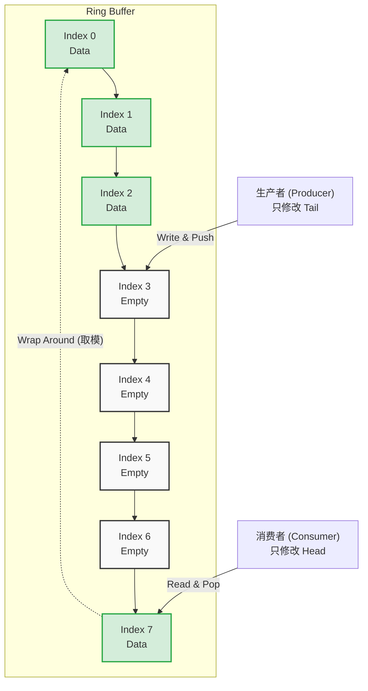
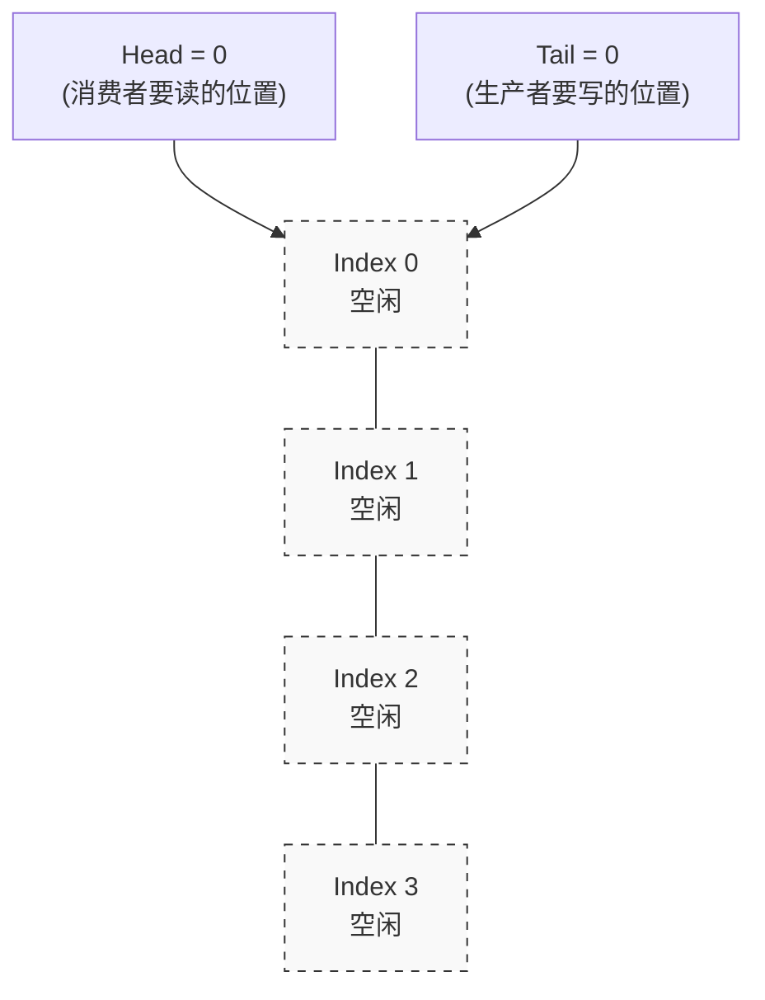
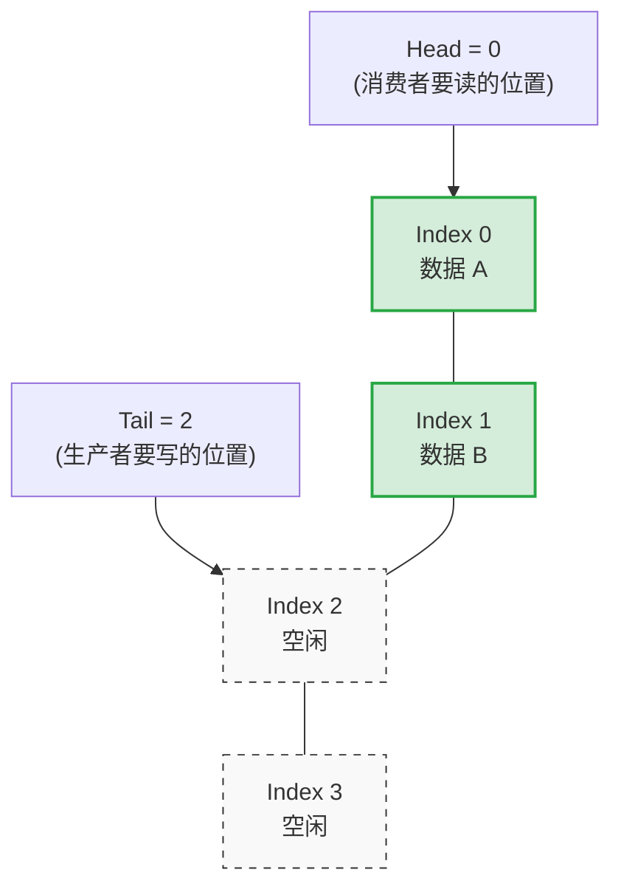
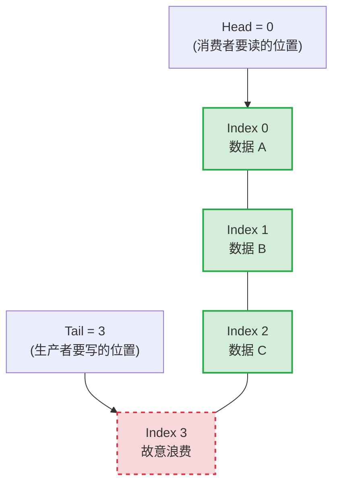

# 什么是 SPSC Ring Buffer？

**SPSC (Single Producer Single Consumer)** 表示“单生产者单消费者”模型。
**Ring Buffer (环形缓冲区)** 是一种底层使用固定大小数组，通过 `Head`（头索引）和 `Tail`（尾索引）在逻辑上首尾相连的数据结构。

将这二者结合，即可实现极高性能的**无锁队列（Lock-Free Queue）**。在 SPSC 场景下，由于生产者只操作修改 `Tail`，消费者只操作修改 `Head`，因此只要处理好**内存可见性（Memory Order）**，就可以完全摒弃厚重的互斥锁（Mutex）。

---

## Mermaid 状态图解

我们可以用下面的环形图表述一个 `Size = 8` 的 Ring Buffer 的工作原理。



**核心规则：**
- **空队列判断：** 当 `head == tail` 时，说明队列为空。
- **满队列判断：** 当 `(tail + 1) % Size == head` 时，说明队列已满（故意浪费一个空间用于区分空和满）。

---

## 结合 C++ 代码进行原理解释

在我们的 `queue_demo.cpp` 中，`LockFreeQueue` 就是一个典型的 SPSC Ring Buffer。它的核心在于利用 `std::atomic` 和内存屏障（`std::memory_order`）来替代锁。

### 1. 生产者逻辑 (`push`)

```cpp
bool push(const T& value) {
    // 1. 获取当前的 tail，由于 tail 只有生产者修改，所以用 relaxed 即可
    size_t current_tail = tail.load(std::memory_order_relaxed);
    size_t next_tail = (current_tail + 1) % Size;
    
    // 2. 获取 head 的最新值。必须用 acquire，确保消费者修改的最新 head 和它所取走的数据可见！
    if (next_tail == head.load(std::memory_order_acquire)) {
        return false; // 队列满了
    }
    
    // 3. 写入数据到缓冲区
    buffer[current_tail] = value;
    
    // 4. 更新 tail。必须用 release，保证【第3步的写入】一定发生在【tail更新】之前！
    // 这样消费者一旦看到新的 tail，就一定能看到 buffer 里被写入的新数据。
    tail.store(next_tail, std::memory_order_release);
    return true;
}
```

### 2. 消费者逻辑 (`pop`)

```cpp
bool pop(T& value) {
    // 1. 获取当前的 head，由于 head 只有消费者修改，所以用 relaxed 即可
    size_t current_head = head.load(std::memory_order_relaxed);
    
    // 2. 获取 tail 的最新值。必须用 acquire，匹配生产者的 release。
    // 这一步能保证，如果读到了新的 tail，就一定能安全读取之前生产者写入 buffer 的数据！
    if (current_head == tail.load(std::memory_order_acquire)) {
        return false; // 队列为空
    }
    
    // 3. 从缓冲区取走数据
    value = buffer[current_head];
    
    // 4. 更新 head。必须用 release，保证【第3步的数据读取】一定发生在【head更新】之前。
    // 从而防止生产者过早地覆盖消费者还没来得及读完的数据。
    head.store((current_head + 1) % Size, std::memory_order_release);
    return true;
}
```

### 总结：Release-Acquire 语义的绝妙配合
生产者使用 `store(release)` 发布数据，消费者使用 `load(acquire)` 消费数据。两者通过 `atomic` 变量 `head` 和 `tail` 形成了一座内存同步的桥梁，完美避开了互斥锁导致的上下文切换开销，从而在性能测试中能看到 `LockFreeQueue` 的吞吐量远超 `LockBasedQueue`。


>     *   当前 `tail = 3`，`head = 4`（消费者读取快，在追着生产者）。
>     *   计算：`(3 + 1) % 8 = 4 % 8 = 4`。因为 `4 == 4`，**队列已满！** 不能写入。此时 `Index 3` 就是被故意空出来浪费的那个坑位。

---

## 图解：空、满与“故意浪费的空间”

我们将一个容量 `Size = 4` 的环形数组在逻辑上“展平”，看看它在三种不同状态下是什么样子的。

### 1. 队列为空 (Empty)

当没有任何数据时，生产者和消费者停在同一个位置。
**空队列判断：`Head == Tail`** (即 `0 == 0`)



### 2. 队列不满 (Partially Full)

生产者写入了 2 个数据，`Tail` 向后移动了 2 步。消费者还未开始读取。
此时：`Head = 0`, `Tail = 2`。
因为 `Head != Tail` (不空)，且 `(2 + 1) % 4 = 3 != 0` (不满)，所以既可以读也可以写。



### 3. 队列已满 (Full) - 为什么必须浪费一个空间？

生产者继续写入了 1 个数据（数据 C），`Tail` 来到了 `Index 3`。
此时我们计算下一个位置：`(Tail + 1) % Size = (3 + 1) % 4 = 0`。
这就等于现在的 `Head (0)`，所以**触发满队列判断，队列已满！**



#### 💡 灵魂拷问：如果不浪费 Index 3 会怎么样？
假设我们不浪费空间，允许生产者把 `Index 3` 也填上数据 D。
填完之后，`Tail` 就会向后走一步，变成 `(3 + 1) % 4 = 0`。
此时的局面变成了：
*   队列里面塞满了 4 个数据。
*   `Head = 0`
*   `Tail = 0`

**灾难发生了！** 这和上面【状态 1：队列为空】时的指针长得**一模一样**！
在无锁的场景下，仅凭 `Head == Tail`，系统根本无法分辨到底是**“全空”**还是**“全满”**。
所以，我们**永远让 Tail 与 Head 之间隔着一个绝对不写入数据的格子**，用 `(Tail + 1) % Size == Head` 代表满，用 `Head == Tail` 代表空，这是一种极其精妙又简单的区分手段。

---

## 解释


```cpp
    bool push(const T& value) {
        size_t current_tail = tail.load(std::memory_order_relaxed);
        size_t next_tail = (current_tail + 1) % Size;
        
        // 如果 next_tail 追上 head，说明队列已满
        if (next_tail == head.load(std::memory_order_acquire)) {
            return false;
        }
        buffer[current_tail] = value;
        tail.store(next_tail, std::memory_order_release);
        return true;
    }
```

push中：为啥tail.load(std::memory_order_relaxed) head.load(std::memory_order_acquire)


为什么需要 Memory Order（内存屏障）？

这也是无锁编程的精髓。你可能会想，既然原子变量已经保证了“不可分割”，直接读写不就行了吗？

不行。因为 CPU 和编译器非常喜欢“擅作主张”地重排代码（Instruction Reordering）。 只要它们认为两行代码没有直接依赖关系，为了执行得更快，它们就会打乱代码的执行顺序。

在单线程下重排没问题，但在多线程下，重排会导致灾难（比如线程 A 先发了“完成”信号，再写数据；线程 B 看到信号就去读数据，结果读到了垃圾数据）。

memory_order 就是用来限制 CPU 和编译器乱序行为的规则（内存屏障）。


memory_order_relaxed（松散模型）
通俗理解：“我只保证这次 load 或 store 本身是原子的，但我不关心其他代码的执行顺序，CPU 你随便重排。”

适用场景： 当你只关心这个变量本身的值，而这个变量的值不会被当做其他数据的“同步信号”时使用。因为没有任何屏障，它的执行性能最高

memory_order_acquire（获取模型）

通俗理解：“这是一个单向的半透膜屏障。在这行 load(acquire) 代码之后的所有读写操作，绝对不准被 CPU 重排到这行代码之前！”

它通常和写操作 memory_order_release 成对出现，形成传说中的 Acquire-Release 语义。

线程 A： 执行写入数据 -> store(release)（发布信号）
线程 B： load(acquire)（获取信号） -> 读取数据
一旦线程 B 通过 acquire 读到了线程 A 通过 release 写入的值，它就能100% 确保看到线程 A 在 release 之前写入的所有数据。（指的是线程A在store之前做的“执行写入数据”操作！！！！类比的就是上面的：`buffer[current_tail] = value;`

成对出现，指的是对同一个原子变量！

---

这个问题问到了无锁编程最核心的精髓所在！要彻底理解这个看似矛盾的地方，我们必须要牢记当前这个队列的大前提：SPSC（单生产者单消费者）。

这意味着：

永远只有 1 个线程（生产者）在调用 push。
永远只有 1 个线程（消费者）在调用 pop。
带着这个大前提，我们来逐个拆解：

1. 为什么 tail.load 可以用 relaxed？
答案：因为“自产自销”，不需要防备别人。

在 push 函数中，我们在读取 tail 的值。
回忆一下，整个系统里有谁会修改 tail 吗？ 只有生产者自己（在 push 函数的最后一行）。消费者是绝对不会去修改 tail 的。
既然当前正在执行 push 的就是生产者本线程，它读取一个只有它自己才会修改的变量，这在 CPU 看来就和普通的单线程程序没有任何区别。
单线程内天然保证顺序性，它绝不可能读到什么“中间状态”或者“过期的值”。因此，这里根本不需要任何昂贵的内存屏障去和其他线程同步，直接用性能最高的 std::memory_order_relaxed，告诉 CPU：“帮我拿一下这个值就行，不用搞什么排队和屏障”。
2. 为什么 head.load 必须用 acquire？
答案：因为这是“跨线程通信”，必须防备 CPU 乱序执行。

在 push 函数中，我们在读取 head 的值。

整个系统里是谁在修改 head？ 是消费者线程（在 pop 函数的最后一行，用 release 发布的）。

这里发生了跨线程的数据读取！生产者需要看消费者的进度（腾出空位没）。

为什么一定要用 acquire 形成内存屏障？假设我们这里也用了 relaxed，CPU 为了优化性能，可能会做一件可怕的事情：指令重排。

如果没有 acquire 屏障，CPU 可能会想：“读 head 这件事有点慢（可能要跨 CPU 缓存去拿），我先把下面的 buffer[current_tail] = value（写数据）给执行了吧！”

一旦发生这种乱序：

生产者还没确认 head（没确认消费者到底有没有把数据拿走）。
生产者就提前把新数据写进了 buffer。
如果这个时候那个格子里原来的数据刚好还没被消费者读完，数据就被无情覆盖（破坏）了！
所以，这里必须用 std::memory_order_acquire。它像一道不可逾越的高墙，向 CPU 强硬声明：“在 head 的最新值被安全拿到并且校验通过之前，下面的 buffer[current_tail] = value 绝对、绝对不准提前执行！”

极简总结
在 push 操作中：

tail 是“我的进度”：我自己看自己的进度，随便看，用 relaxed 最快。
head 是“别人的进度”：我看别人的进度来决定我的下一步动作，必须用 acquire 竖起屏障，防止我的下一步动作提前跑偏，覆盖了别人的心血。
这就是为什么在同一个函数里，对于两个不同原子变量的 load，采取了完全不同的内存顺序策略的原因。这一切都是为了在保证绝对安全的前提下，压榨出每一滴硬件性能。


*   **head 是“别人的进度”**：我看别人的进度来决定我的下一步动作，必须用 `acquire` 竖起屏障，防止我的下一步动作提前跑偏，覆盖了别人的心血。

这就是为什么在同一个函数里，对于两个不同原子变量的 load，采取了完全不同的内存顺序策略的原因。这一切都是为了在**保证绝对安全的前提下，压榨出每一滴硬件性能**。

---

### 什么是指令重排（Instruction Reordering）？举个经典反例

**指令重排**是编译器（在编译时）和 CPU（在运行时，即乱序执行）为了提高性能，在**不改变单线程最终执行结果**的前提下，打乱代码执行顺序的一种优化手段。

但是在多线程环境下，这种优化会破坏线程间的同步逻辑。看下面这个经典的例子：

```cpp
int data = 0;
bool ready = false;

// 线程 A（生产者）执行
void producer() {
    data = 42;       // 步骤 1：准备数据
    ready = true;    // 步骤 2：发出“数据已准备好”的信号
}

// 线程 B（消费者）执行
void consumer() {
    while (!ready) { // 步骤 3：死循环等待信号
        // 等待
    }
    print(data);     // 步骤 4：收到信号，打印数据
}
```

**单线程的视角：** 编译器或 CPU 发现 `data = 42` 和 `ready = true` 这两行代码之间**毫无因果关系（没有数据依赖）**。为了提高执行效率，它们极有可能会把**步骤 2 放到步骤 1 之前**执行！

**多线程的灾难：** 
假设发生了指令重排，线程 A 先执行了 `ready = true;`，**还没来得及**执行 `data = 42;`。
就在这零点几微秒的间隙，线程 B 飞速运转，看到 `ready == true`，跳出循环，直接执行 `print(data);`。
此时，**线程 B 打印出来的是 `0`（或者内存里的垃圾数据），而不是 `42`！**

这也就是为什么我们在无锁编程中，必须用 `std::atomic` 和 `memory_order_release` / `memory_order_acquire` 设立**内存屏障**，强行禁止编译器和 CPU 在关键的同步点附近进行这种“聪明过头”的指令重排。
